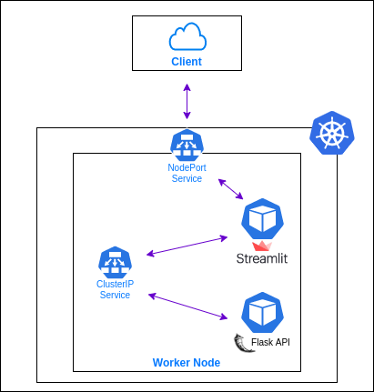
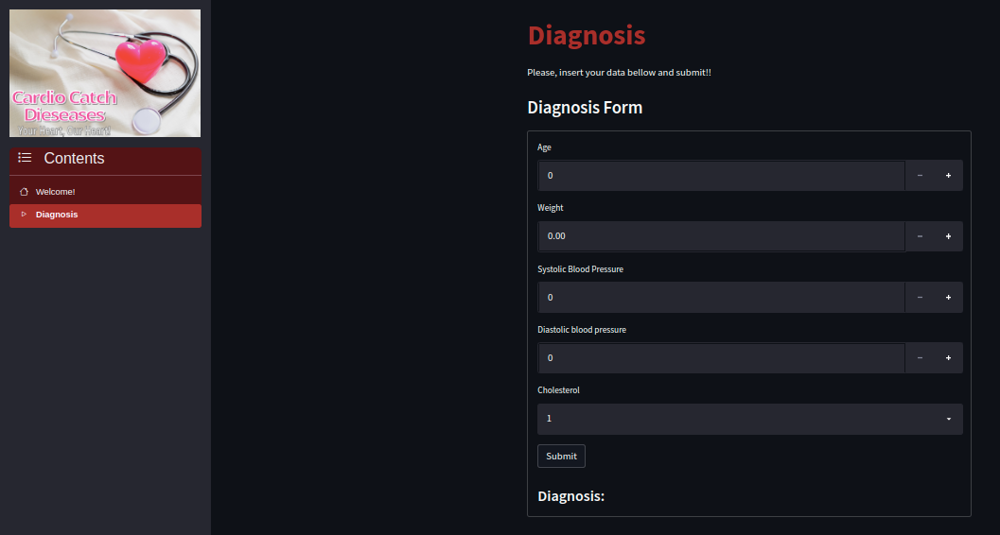

# Flask API and Streamlit WebAPP Deployment with Kubernetes

Hi!!

This repository contains personal Kubernetes concepts and practices studies for _Machine Learning Model Deployment_.

The idea was to start simple, building a simple front-end and back-end cluster, without any kind of security or proxy access, and make them communicate with each other.
Doing so, the goal is to incresase our cluster complexity little by little.

Please, check bellow the "Done so Far" section for update details.

The image bellow shows the latest cluster structure. 

  

---
## The application: a summary
In one shot: a Streamlit app that makes a POST request to a Flask API which returns whether or not a patient with the given data has a cardiovascular disease.

The Streamlit app looks like the following:

  

---
## Done so Far

- **August, 31, 2022**: initial cluster. In the worker node, we have only two deployments (streamlit webapp and a Flask API). The ClusterIP Service allows the webapp to communicate with the backend (Flask API) internally. The NodePort service allows us to access the front webapp and submit a form for the ML prediction.